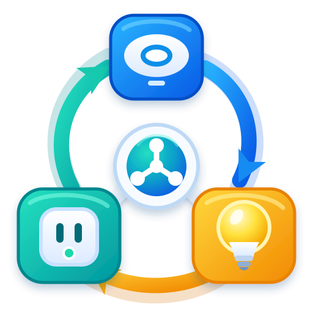

# Cross-Platform Device Sync for Home Assistant

[](https://github.com/jameslu34/ha-platform-sync/releases)
[](LICENSE)
[](https://github.com/jameslu34/ha-platform-sync/actions/workflows/validate.yml)

<p align="center">
  
</p>

Cross-Platform Device Sync is a Home Assistant custom integration for selecting
a Home Assistant entity set once and continuously maintaining its exposure
across Google Home, HomeKit, and Matterbridge. It avoids selecting and updating
the same devices separately on every target platform.

Choose devices from one or more Home Assistant dashboard views, select entities
manually, or use the current Home Assistant-side exposure list of a supported
platform. Add per-platform exceptions, then let the integration reconcile only
when the source set changes.

HomeKit devices that require a separately paired accessory (including cameras)
are reported as `deferred_accessory_mode` and do not block synchronization to
the other selected platforms. Pair the dedicated HomeKit accessory to complete
their HomeKit exposure.

> **What it does not synchronize:** this is not a Home Assistant backup,
> failover, clustering, migration, or instance-to-instance replication tool.
> It does not copy automations, history, settings, entity states, or an entire
> Home Assistant system. It only manages which Home Assistant entities are
> included in the selected platforms' Home Assistant-side exposure lists.

> This is an independent community project. It is not affiliated with, endorsed
> by, or supported by Home Assistant, Nabu Casa, Google, Apple, or Matterbridge.

[](https://my.home-assistant.io/redirect/hacs_repository/?owner=jameslu34&repository=ha-platform-sync&category=integration)

Install through the button above, or add `jameslu34/ha-platform-sync` as a HACS
custom repository with the **Integration** category.

## Documentation

- [Complete English user guide](docs/USER_GUIDE.en.md)
- [繁體中文完整使用手冊](docs/USER_GUIDE.zh-Hant.md)

The configuration interface is available in English and Taiwan Traditional
Chinese (`zh-Hant`). English is the primary language of this public repository;
both user guides describe the same features and setup flow.

## Highlights

- Dashboard source with multi-view selection and exact union behavior
- Manual entity selection
- Google Home, HomeKit, or Matterbridge as a Home Assistant-side source
- Independent Google Home, HomeKit, and Matterbridge targets
- Per-target always-include and exclude lists
- A single enable switch that fully pauses monitoring and synchronization
- Event-driven dashboard and HomeKit detection where Home Assistant supports it
- Startup reconciliation, with a 60-second fallback poll for remote sources that do not
  expose a suitable change event
- Two-second event coalescing to avoid repeated writes during rapid changes
- No-op detection when the calculated target sets are unchanged
- Backup, deterministic apply order, exact readback, and reverse-order rollback
- English and Traditional Chinese setup flows
- Complete settings persistence across validation errors, target changes, and
  later Configure sessions
- No extra sensor, button, or settings entity

The integration changes platform exposure configuration only. It never turns a
light or switch on or off and never controls locks, alarms, climate devices,
cameras, or media playback.

## Requirements

- A supported Home Assistant installation with access to custom integrations
- A full Home Assistant backup before the first synchronization
- HACS for the recommended installation method, or file access for manual
  installation
- Only the platform integrations you plan to use:
  - Google Home: Home Assistant Google Assistant configured and account-linked
  - HomeKit: one or more Home Assistant HomeKit Bridge or Accessory entries
  - Matterbridge: Matterbridge with the `matterbridge-hass` plugin running and
    connected; optional frontend-password and WSS reverse-proxy endpoints are
    supported

### Tested compatibility

The current release has been live-validated with this combination:

| Component | Validated version |
|---|---:|
| Home Assistant Core | 2026.8.3 |
| Matterbridge | 3.10.7 |
| `matterbridge-hass` | 1.5.0 |

These are tested versions, not declared minimum versions. Other versions may
work, but should be validated with a backup and `platform_sync.preview` first.

Google Home targets additionally require `expose_by_default: false`, a dedicated
Google Assistant `entity_config` include file, and the
`google_assistant.request_sync` action. See the user guide before enabling this
target.

## Install with HACS

[](https://my.home-assistant.io/redirect/hacs_repository/?owner=jameslu34&repository=ha-platform-sync&category=integration)

This repository is HACS-compatible as a custom repository. The current
[HACS default-catalog validation](https://github.com/hacs/integration/blob/main/custom_components/hacs/validate/license.py)
requires an OSI-approved license, so this project is intentionally distributed
as a custom repository:

1. Install and configure [HACS](https://www.hacs.xyz/) if it is not already
   available.
2. Use the button above, or open **HACS → Integrations → three-dot menu → Custom
   repositories**.
3. In the **Repository** field, enter `jameslu34/ha-platform-sync`, then choose
   **Integration**.
4. Find **Cross-Platform Device Sync** in HACS and select **Download**.
5. Restart Home Assistant.
6. Open **Settings → Devices & services → Integrations → Add integration** and
   search for **Cross-Platform Device Sync**.

## Manual installation

1. Download the latest GitHub release.
2. Copy `custom_components/platform_sync` into your Home Assistant configuration
   directory as `/config/custom_components/platform_sync`.
3. Confirm there is no extra directory level between `custom_components` and
   `platform_sync`.
4. Restart Home Assistant.
5. Open **Settings → Devices & services → Integrations → Add integration** and
   search for **Cross-Platform Device Sync**.

## Quick start

The setup wizard shows only fields required by your earlier choices:

1. Enable synchronization and choose a source.
2. Select dashboard views, entities, or HomeKit source entries when that source
   needs an additional selection page.
3. Choose one or more target platforms.
4. Configure only the selected targets and their optional additions or
   exclusions. For HomeKit, explicitly identify the main Bridge and grant
   lifecycle authority only to intended single-device side accessories.
5. Review the final summary, including the devices expected to need an
   additional native-platform pairing or controller-side check, and submit it.

Every saved source and platform setting remains available for later editing.
If a field fails validation, the other values entered on that page stay in the
form. Settings for an unselected target are hidden and inactive, but retained
so they are restored if that target is selected again.

If synchronization is left disabled, the first page saves immediately. No
source is read, no listener or poll is registered, and no target is changed.

## How reconciliation works

For every selected target, the final set is calculated in this order:

1. source entities
2. user exclusions and additions
3. dynamic compatibility exclusions
4. installation-managed locked rules, when present

In set form, the generic rule is `(source - exclusions) ∪ additions`, followed
by compatibility and protected deployment rules. Every existing exposure that
is outside that final set is removed from the selected target. Unselected
targets are left unchanged. Removal changes only the integration-managed
exposure configuration; it never deletes the Home Assistant entity. When an
explicitly lifecycle-managed HomeKit side accessory leaves the source, the
integration may remove its Home Assistant Config Entry, but Apple Home may
still require the owner to remove its unavailable tile manually.

Rapid source events are combined for two seconds. Every enabled configuration
runs one full source scan when Home Assistant or the integration starts.
Dashboard and HomeKit sources use change events where possible and retain a
five-minute no-op target health reconciliation so target-side drift cannot remain
hidden when the source does not change. Dashboard sources also compare a
source-only fingerprint every 15 seconds because some storage-dashboard save
paths omit the Lovelace change event; unchanged fingerprints do not read or
write platform targets. Google Home and Matterbridge sources use
one fixed 60-second fallback poll; HomeKit uses the same poll only when its change
signal is unavailable. A fallback poll performs the full health reconciliation,
so no duplicate five-minute timer is registered. Manual sources do not poll and
use only the five-minute target health audit.

When the calculated sets are unchanged, the run is a no-op. When a change is
needed, targets are backed up and applied in Google Home → HomeKit →
Matterbridge order. A failure starts reverse-order rollback and exact readback.

Enabled background checks also validate Matterbridge's bridge, plugin, exact
allowlist, filters, and loaded devices. If the management API is reachable and
the saved credentials and exact non-empty allowlist are still intact, a
runtime-only failure can recover automatically. The integration waits for the
backup archive to finish, restarts `matterbridge-hass` first, and restarts the
full Matterbridge process only if exact readback still does not converge. It
allows a three-minute startup grace, requires a sustained failure, then
attempts guarded recovery once per failure episode with a five-minute cooldown.
Persistent failures retry after 15, 30, 60, 120, then 300 seconds.
Unreachable APIs, missing credentials, disabled plugins, malformed or changed
allowlists, and competing filters never authorize an automatic restart.

## Platform notes and limitations

Platform Sync sends all user-visible runtime notices only through Home
Assistant's built-in persistent notifications. It does not call mobile or
external notify services, send webhooks, or write messages to a custom
dashboard. A dashboard that independently mirrors HA persistent notifications
should exclude notification IDs beginning with `platform_sync_` if duplicate
display is not wanted.

- **Google Home:** the source and target are the Home Assistant Google Assistant
  exposure configuration. The integration also checks HA's native SYNC
  serialization and the linked-user/request-sync result. Read-only `sensor` and
  `binary_sensor` entities for which the installed HA Google classifier has no
  native trait are reported separately as platform-unsupported; they are not
  disguised as switches and cannot be fixed by pairing. Locks remain native
  `LOCK` devices, alarm control panels remain `SECURITYSYSTEM` devices, and
  compatible cameras remain `CAMERA` devices. A selected controllable or
  security entity that HA's native classifier rejects is omitted from the
  effective Google exposure instead of aborting the other targets; the exact
  entity and corrective action are shown in HA. For example, a camera without
  HA's native `STREAM` capability cannot become a viewable Google camera and is
  never disguised as a switch. Google Home mobile-app rendering still requires
  controller-side acceptance and cannot be inferred from local files.
- **HomeKit:** source and target choices are Home Assistant HomeKit Bridge or
  Accessory config entries. Accessories paired directly in Apple Home are not
  readable or writable through this integration. Writable targets that need
  automatic changes require an explicitly identified, UI-managed main Bridge;
  its durable Config Entry identity prevents a later one-device layout from
  being mistaken for a removable side accessory. YAML/import-managed
  entries can be read as sources and may remain in a target layout only as
  fixed exact single-entity side entries, regardless of their stored HomeKit
  mode. Camera, lock, supported TV/receiver/projector, and activity-remote
  entities that require accessory mode are created as dedicated native HomeKit
  Config Entries after the reversible three-platform transaction succeeds.
  The final setup screen and a persistent Home Assistant notification list the
  exact accessories that still need pairing in Apple Home; no PIN or token is
  included. An unpaired main Bridge is listed once; normal endpoints inside it
  do not need per-device pairing, while each dedicated side accessory is paired
  separately. Only side entries explicitly granted lifecycle ownership may be
  removed automatically, and removal requires two identical source reads at
  least 15 seconds apart. Imported side accessories additionally require a
  configured dedicated YAML include file, an exact name/port/entity match, a
  backup, and readback before deletion. Main Bridges, HomeKit source entries,
  unrelated accessories, and protected Apple TV entities are never pruned. A
  wrong or ambiguous YAML path fails before removal, and `configuration.yaml`
  itself is never accepted as the dedicated accessory file. If Home Assistant
  reports that removal requires restart, that state remains visible and sync
  is not called complete until a new Core process starts.
- **Matterbridge:** requires a compatible and reachable `matterbridge-hass`
  management interface. A host/IP or complete `ws`, `wss`, `http`, or `https`
  endpoint may be used, with an optional frontend password. The integration
  writes an exact device list and clears platform-selection label filters.
  Device removals use a full Matterbridge process generation barrier so an old
  aggregator endpoint cannot be accepted merely because the plugin's device
  index changed. Normal bridged endpoints do not require per-device pairing.
  When `enableServerRvc` creates separately commissionable vacuum nodes, the
  setup review and HA notification name each vacuum to check in Matterbridge's
  **Devices** panel; scan its QR only if the controller has not already paired
  it. The management API cannot verify controller fabric membership, so this
  remains an explicit owner check. Matter has no native camera or alarm-panel
  device type. Such selections remain available to Matterbridge so supported
  endpoints on the same HA device can still be discovered, but the integration
  reports the limitation and never claims that a Matter controller can display
  a camera feed or native alarm panel.
- **Dashboards:** device entities are collected from selected views; card style,
  layout, ordering, and non-entity content are not synchronized.
- **Native apps:** Google request-sync acceptance, a HomeKit Config Entry
  readback, or a Matterbridge process-generation readback does not prove that
  Google Home, Apple Home, or another controller app has already refreshed.
- Exact synchronization may remove an entity from a selected target's exposure
  list when it leaves the source. Review a preview and keep platform backups.

## Privacy and safety

- Processing runs inside Home Assistant and the configured local platform
  connections. This project does not provide a cloud service or telemetry
  endpoint.
- Matterbridge connection details and platform configuration remain in your
  Home Assistant configuration. Protect backups and diagnostics accordingly.
- Never post passwords, tokens, cookies, private keys, API keys, private host
  names, or unredacted diagnostics in a public issue.
- Use **Developer tools → Actions → `platform_sync.preview`** before a major
  change. `platform_sync.sync_now` applies the current plan immediately.
- Create platform-specific exclusions for devices that are already paired
  natively to avoid duplicate accessories.

See [SECURITY.md](SECURITY.md) for private vulnerability reporting guidance.

## Development

Contributions are welcome. Read [CONTRIBUTING.md](CONTRIBUTING.md), then run:

```bash
python tests/simulate_acceptance.py
python tests/simulate_adapter_acceptance.py
python tests/simulate_config_flow_acceptance.py
python tests/validate_translations.py
python tests/test_homekit_lifecycle.py
python tests/test_homekit_pairing.py
python -m compileall custom_components/platform_sync tests
```

GitHub Actions runs the acceptance simulations and Home Assistant hassfest
validation.

## License

Version 0.6.1 and later are source-available under the
[PolyForm Noncommercial License 1.0.0](LICENSE). You may inspect, use, modify,
and redistribute the software and modified versions for permitted
noncommercial purposes. Commercial use is not licensed.

This is a noncommercial source-available license, not an OSI-approved open
source license. Versions released before 0.6.1 remain under the license that
accompanied those versions.
